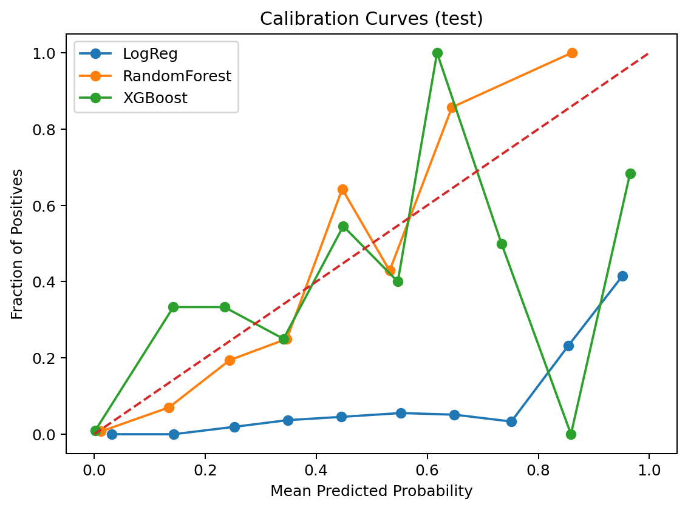

# 📊 Lab 5 — Company Bankruptcy Prediction

This project implements an **end-to-end machine learning pipeline** for predicting company bankruptcy using the Taiwan Bankruptcy Dataset. It builds on **Lab 4 research decisions** and automates preprocessing, feature selection, model training, evaluation, and explainability.

## 🚀 Objectives
- Handle severe **class imbalance** (~3% bankrupt companies).
- Automate **data preprocessing** (imputation, outlier handling, correlation filter, scaling).
- Train & evaluate **three models**: Logistic Regression, Random Forest, and XGBoost.
- Compare performance using **ROC-AUC, PR-AUC, Brier Score, Accuracy**.
- Validate results with **calibration curves, SHAP explainability, and drift analysis**.
- Ensure **reproducibility** with fixed seeds and documented dependencies.

## ⚙️ Repository, Setup & Running

### Repository Structure
├── artifacts/                # Generated outputs
│   ├── curves/               # ROC, PR, Calibration plots
│   ├── eda/                  # Class balance & correlation heatmap
│   ├── drift/                # PSI drift checks
│   ├── shap/                 # SHAP explainability plots
│   ├── *.joblib              # Saved best models
│   ├── selected_features.csv # Final feature set
│   └── model_comparison.csv  # Metrics summary
├── REPORT.md                 # Lab 5 final report
├── training_pipeline.py      # Main pipeline script
├── requirements.txt          # Python dependencies
├── .gitignore                # Ignore cache, venv, large files
text
### Setup & Installation
```bash
# Clone the repository
git clone <your-repo-url>
cd Lab5-Bankruptcy-Prediction

# Create virtual environment
python -m venv .venv
source .venv/bin/activate   # Mac/Linux
.venv\Scripts\activate      # Windows

# Install dependencies
pip install -r requirements.txt

# Run the pipeline
python training_pipeline.py --data_csv path/to/bankruptcy.csv --target "Bankrupt?" --out_dir artifacts
Dataset Overview

Rows × Columns: 6819 × 96
Target positive rate: 3.23%
Selected features: 63/95

Model Performance

ModelTest PR-AUCTest ROC-AUCAccuracy🌲 RandomForest0.5560.9600.971⚡ XGBoost0.5480.9580.969➕ Logistic Reg0.4310.9480.863
📈 Visual Results
🔹 EDA

Class imbalance (rare bankruptcies):


Correlation heatmap (highly correlated features dropped):


🔹 Model Evaluation

ROC curves (how well models separate bankrupt vs safe companies):


PR curves (focus on catching rare bankruptcies):


Calibration curves (how reliable probability predictions are):



🔹 Confusion Matrices (Test)

Logistic Regression
text[[1139, 181],
 [   6,  38]]

RandomForest
text[[1315,   5],
 [  34,  10]]

XGBoost
text[[1305,  15],
 [  27,  17]]


🔹 Explainability & Stability

SHAP summary (key financial drivers of bankruptcy):


PSI Drift check (train vs test stability):


🧩 Challenges & Reflections

Severe class imbalance solved with class weighting (avoided SMOTE noise).
Random Forest & XGBoost achieved strong separation (high ROC-AUC).
Logistic Regression was better calibrated but weaker on recall.
Hyperparameter tuning balanced compute cost vs. performance (25 trials).
PSI checks confirmed stable train/test distributions → confidence in deployment.
Lesson learned: Simple, interpretable methods with consistent preprocessing can still achieve strong, reproducible results.
