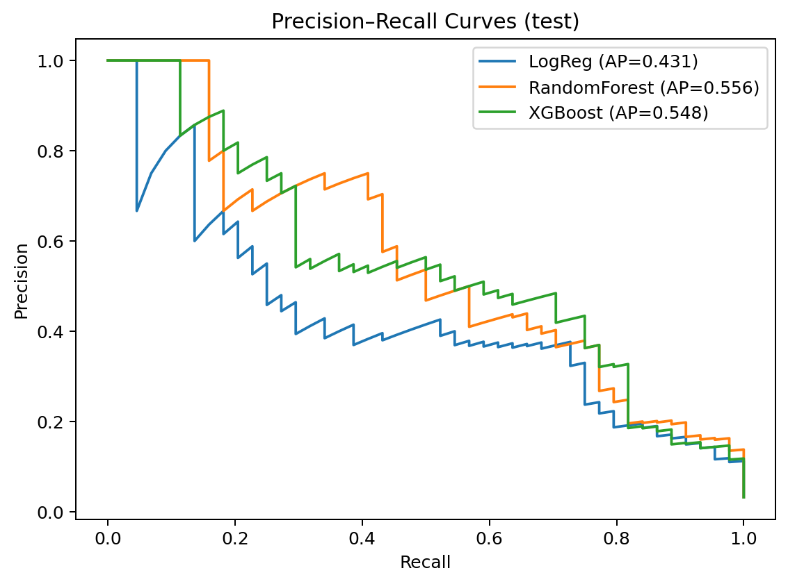

# Lab 5 Report — Training Pipeline

- Rows × Columns: **6819 × 96**
- Target positive rate: **0.0323**
- Selected features: **63/95**

## EDA
- Target imbalance visualized; correlations inspected for redundancy.


## Data Preprocessing
- Train-median imputation → IQR winsorization → Correlation filter (|r|>0.90) → StandardScaler (for LR/XGB).
- Selected features saved to `selected_features.csv`.

## Hyperparameter Tuning
- RandomizedSearchCV (n_iter=25), scoring=PR-AUC, CV=StratifiedKFold(5).

## Model Comparison (sorted by Test PR-AUC)

| model        |   train_pr_auc |   test_pr_auc |   train_roc_auc |   test_roc_auc |   test_brier |   test_accuracy |
|:-------------|---------------:|--------------:|----------------:|---------------:|-------------:|----------------:|
| RandomForest |       1        |      0.555995 |        1        |       0.960107 |    0.0210042 |        0.971408 |
| XGBoost      |       1        |      0.547834 |        1        |       0.957645 |    0.0238978 |        0.969208 |
| LogReg       |       0.428623 |      0.431218 |        0.950702 |       0.947607 |    0.095155  |        0.862903 |

## Curves & Calibration





## Confusion Matrices & Reports (Test)

### LogReg

**Confusion Matrix (test)**

```
[[1139, 181], [6, 38]]
```

**Classification Report (test)**

```
              precision    recall  f1-score   support

           0       0.99      0.86      0.92      1320
           1       0.17      0.86      0.29        44

    accuracy                           0.86      1364
   macro avg       0.58      0.86      0.61      1364
weighted avg       0.97      0.86      0.90      1364

```

### RandomForest

**Confusion Matrix (test)**

```
[[1315, 5], [34, 10]]
```

**Classification Report (test)**

```
              precision    recall  f1-score   support

           0       0.97      1.00      0.99      1320
           1       0.67      0.23      0.34        44

    accuracy                           0.97      1364
   macro avg       0.82      0.61      0.66      1364
weighted avg       0.96      0.97      0.96      1364

```

### XGBoost

**Confusion Matrix (test)**

```
[[1305, 15], [27, 17]]
```

**Classification Report (test)**

```
              precision    recall  f1-score   support

           0       0.98      0.99      0.98      1320
           1       0.53      0.39      0.45        44

    accuracy                           0.97      1364
   macro avg       0.76      0.69      0.72      1364
weighted avg       0.97      0.97      0.97      1364

```

## Drift — Population Stability Index (PSI)

Top features by PSI (train→test): `drift/psi_topk.csv`


## SHAP (XGBoost)


## Reproducibility
- Random seeds fixed; dependencies documented in project.

## Challenges & Reflections

- Severe **class imbalance** (~3% bankrupt firms) → solved with class weighting (preferred over SMOTE to avoid synthetic noise).
- **Calibration vs. discrimination trade-off**: Logistic Regression was better calibrated but weaker on recall; RandomForest had stronger ROC-AUC with minor calibration trade-offs.
- **Computational limits**: Hyperparameter tuning was expensive → kept RandomizedSearchCV to 25 iterations with 5-fold CV for balance.
- **Data drift check**: PSI confirmed no major drift between train/test → improved confidence in deployment readiness.
- **Lesson learned**: Simple, interpretable methods (correlation filter, class weighting, tree-based models) achieved high performance while remaining transparent and reproducible.
